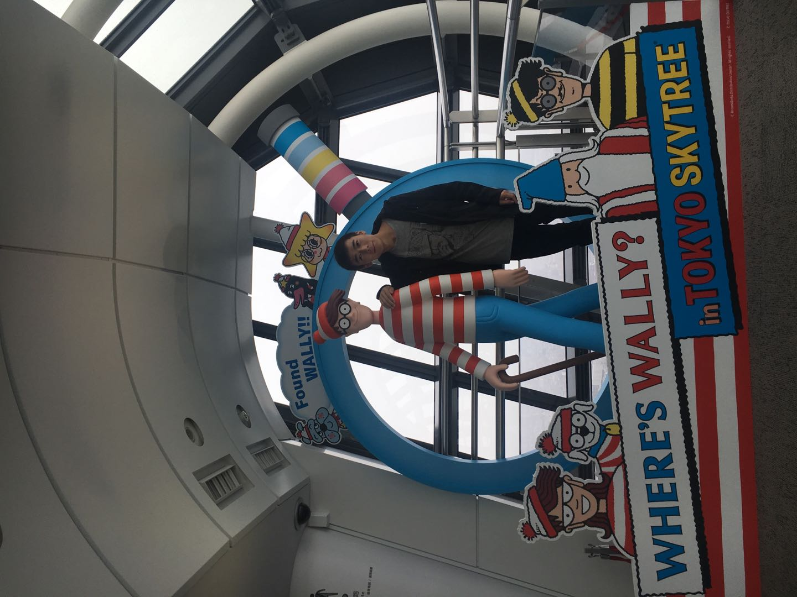

## About Me

Hi! I am a junior year student of Master at School of Electronics Engineering and Computer Science, [Peking University](https://www.pku.edu.cn/), and under the supervision by professor [Shiliang Zhang](https://www.pkuvmc.com). I've received the B.E. degree from School of Computer Science of [Sichuan University](http://www.scu.edu.cn/) in 2016. I'm familiar with C/C++, Java, Python and Caffe, Pytorch.

<!-- This is a jekyll based resume template. You can find the full source code on [GitHub](https://github.com/bk2dcradle/researcher) -->

## Research Interest

My research interest include Edge Detection, Semantic Segmentation, and Deep Learning.

## Experience
* Intership in Horizon Robotics Inc., May 2018 -- May 2019
* Vice president of IBM Club, Sichuan University, 2014 -- 2015
* Vice president of Web Development Association, SiChuan University, 2014 -- 2015

## Publications

1. **Jianzhong He**, Shiliang Zhang and etc.: Bi-Direction Cascade Network for Perceptual Edge Detection(**CVPR2019**).
2. **Jianzhong He**, Xiaobin Liu and Shiliang Zhang: EAGER: Edge-Aided imaGe undERstanding System(**ICMR2019**).

## Skills

* Programming Level: Familiar with C, C++ and Python ect. programming language and Caffe, Pytorch and MXNET etc. deep learning frame work. And with some knowledge of SQL, HTML and Javascript etc.
* Research Field: I'm interested in edge detection and image segmentation, and has some knowledge of Object detection, person re-id and fine-grained classification.
* English: CET-6(479)

<!-- ## Typography

This is a [link](http://google.com). Something *italics* and something **bold**.

Here is a table

Year | Award | Category
-----|-------|--------
2014 | Emmy  | Won Outstanding Lead Actor in a miniseries or a movie
2015 | BAFTA | Nominated for Best Leading Actor for Sherlock
2014 | Satellite | Won Best Actor miniseries or television film

Here is a horizontal rule

---

Here is a blockquote

> To a great mind, nothing is little -->

<!-- ## References -->
<!-- ## Reference

* Foo Bar: Head of Department, Placeholder Names, Lorem
* John Doe: Associate Professor, Department of Computer Science, Ipsum -->

## Awards
* Merit Student, Peking University, 2018
* Postgraduate special scholarship of EECS, Peking University Dec. 2017
* IBM mainframe application of 2014 national campus competition, Single Group, 2nd Prize and Team Group, 3rd Prize Dec. 2014
* The 39th ACM-ICPC international collegiate programming competition, Xi'an, Asian regional competition, Bronze medal Oct. 2014
* The 5th "blue bridge cup" national software and information technology talent competition, 1st Prize of Province and 3rd Prize of National May. 2014
* "Challenge cup" web design competition of sichuan university, 2nd Prize Nov. 2013
* National Scholarship, Sichuan University comprehensive first class scholarship 2014 -- 2015
* IBM Outstanding Student 2015 Scholarship Dec. 2015
* Sichuan University comprehensive second class scholarship 2013 -- 2014
* National Inspirational Scholarship 2013 -- 2014