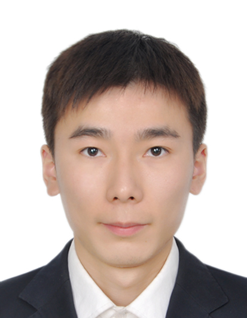

## About Me

Hi! I am a junior year student of Master at School of Electronics Engineering and Computer Science, [Peking University](https://www.pku.edu.cn/), and under the supervision by professor [Shiliang Zhang](www.pkuvmc.com). I've received the B.E. degree from School of Computer Science of [Sichuan University](http://www.scu.edu.cn/) in 2016. I'm familiar with C/C++, Java, Python and Caffe, Pytorch.

<!-- This is a jekyll based resume template. You can find the full source code on [GitHub](https://github.com/bk2dcradle/researcher) -->

## Research Interest

My research interest include Edge Detection, Semantic Segmentation, and Deep Learning.

## Publications

1. **Jianzhong He**, Shiliang Zhang and etc.: Bi-Direction Cascade Network for Perceptual Edge Detection(**CVPR2019**).
2. **Jianzhong He**, Xiaobin Liu and Shiliang Zhang: EAGER: Edge-Aided imaGe undERstanding System(**ICMR2019**).

<!-- ## Typography

This is a [link](http://google.com). Something *italics* and something **bold**.

Here is a table

Year | Award | Category
-----|-------|--------
2014 | Emmy  | Won Outstanding Lead Actor in a miniseries or a movie
2015 | BAFTA | Nominated for Best Leading Actor for Sherlock
2014 | Satellite | Won Best Actor miniseries or television film

Here is a horizontal rule

---

Here is a blockquote

> To a great mind, nothing is little -->

<!-- ## References -->
## Reference

* Foo Bar: Head of Department, Placeholder Names, Lorem
* John Doe: Associate Professor, Department of Computer Science, Ipsum
*
*
*
*
